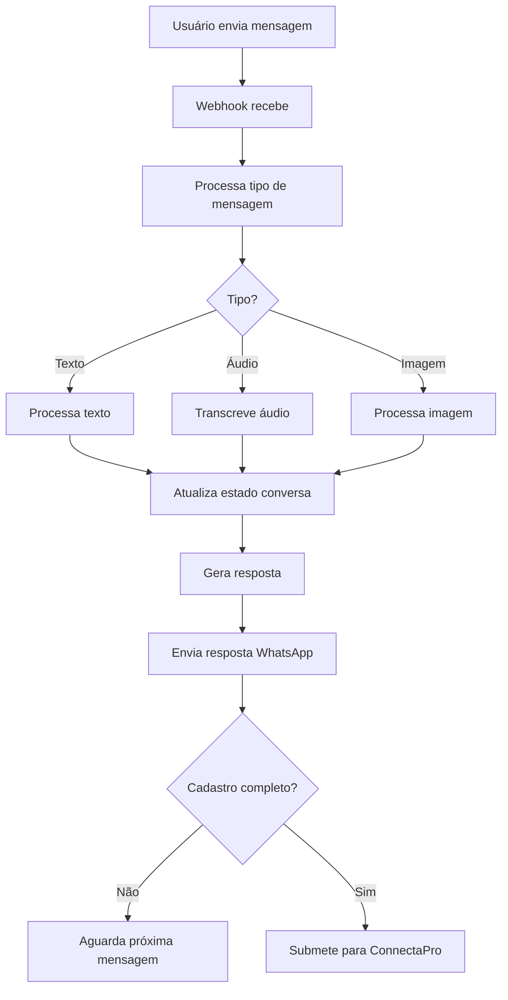

# 🤖 WhatsApp Audio Registration Bot

Bot de cadastro por áudio para trabalhadores da construção civil usando WhatsApp Business API integrado ao ConnectaPro.

## 📋 Visão Geral

Este bot permite que trabalhadores da construção civil com baixa escolaridade se cadastrem na plataforma ConnectaPro usando apenas mensagens de voz pelo WhatsApp, eliminando a necessidade de preencher formulários complexos.

## 🎯 Funcionalidades

### ✅ Implementado (Fase 1)
- ✅ Estrutura básica do projeto Next.js 14 + TypeScript
- ✅ API webhooks para WhatsApp Business Cloud API
- ✅ Gerenciamento de estado de conversas
- ✅ Fluxo de cadastro conversacional completo
- ✅ Integração com banco de dados Supabase
- ✅ Dashboard administrativo para monitoramento
- ✅ Processamento de diferentes tipos de mídia (texto, áudio, imagem)
- ✅ Integração com sistema ConnectaPro existente

### 🔄 Em Desenvolvimento (Fase 2)
- 🔄 Integração real com WhatsApp Business API
- 🔄 Transcrição de áudio com OpenAI Whisper
- 🔄 Upload e armazenamento de fotos
- 🔄 Testes automatizados
- 🔄 Deploy em produção

### 📋 Planejado (Fase 3)
- 📋 Notificações push para admins
- 📋 Analytics avançadas
- 📋 Múltiplos idiomas
- 📋 Integração com CRM

## 🏗️ Arquitetura

```
src/
├── app/
│   ├── api/
│   │   ├── whatsapp/webhook/      # Webhook WhatsApp
│   │   └── admin/                 # APIs admin
│   └── admin/whatsapp-bot/        # Dashboard admin
├── lib/
│   ├── conversation-manager.ts    # Gerencia fluxo de conversas
│   ├── audio-processor.ts         # Processa áudio para texto
│   ├── whatsapp-service.ts        # Integração WhatsApp API
│   ├── conectapro-service.ts      # Integração ConnectaPro
│   └── database-service.ts        # Operações banco de dados
└── types/
    └── whatsapp.ts               # Tipos TypeScript
```

## 📊 Fluxo de Conversa



## 🗣️ Exemplo de Conversa

```
Bot: 👋 Olá! Bem-vindo ao ConnectaPro! 
     Sou seu assistente e vou te ajudar a se cadastrar.
     Para começar, me fale seu nome completo:

Usuário: [áudio] "Meu nome é João Silva"

Bot: 👍 Prazer, João Silva!
     Que tipo de trabalho você faz?
     Exemplos: pedreiro, eletricista, pintor...

Usuário: [áudio] "Sou pedreiro"

Bot: 🔨 Perfeito! Há quanto tempo trabalha como pedreiro?

Usuário: [áudio] "Trabalho há 10 anos"

Bot: 📸 Agora preciso de uma foto sua para o perfil...
```

## 🛠️ Configuração

### 1. Pré-requisitos
- Node.js 18+
- Conta Supabase (já configurada)
- WhatsApp Business Account
- OpenAI API Key (para transcrição)

### 2. Instalação
```bash
# Instalar dependências
npm install

# Configurar variáveis de ambiente
cp whatsapp-bot-env-example.txt .env.local
# Editar .env.local com suas credenciais

# Executar migrações do banco
# Execute whatsapp-bot-schema.sql no Supabase
```

### 3. Configurar WhatsApp Business API

#### 3.1 Meta Business Manager
1. Acesse [Meta Business Manager](https://business.facebook.com/)
2. Crie/selecione sua conta business
3. Adicione WhatsApp Business Account
4. Configure número de telefone

#### 3.2 Webhook Configuration
```
Webhook URL: https://your-domain.com/api/whatsapp/webhook
Verify Token: [seu_token_de_verificacao]
```

#### 3.3 Permissões Necessárias
- `whatsapp_business_messaging`
- `whatsapp_business_management`

### 4. Executar Localmente
```bash
# Desenvolvimento
npm run dev

# Produção
npm run build
npm start
```

## 📱 WhatsApp Business API Setup

### Webhook Events
O bot escuta os seguintes eventos:
- `messages` - Mensagens recebidas
- `message_deliveries` - Status de entrega
- `message_reads` - Status de leitura

### Tipos de Mensagem Suportados
- **Texto**: Mensagens de texto normais
- **Áudio**: Mensagens de voz (transcritas automaticamente)
- **Imagem**: Fotos de perfil e portfólio
- **Documento**: Documentos anexados (futuro)

## 🎤 Transcrição de Áudio

### OpenAI Whisper (Recomendado)
```typescript
// Configuração no audio-processor.ts
const transcription = await openai.audio.transcriptions.create({
  file: audioBuffer,
  model: "whisper-1",
  language: "pt"
});
```

### Alternativas
- Google Speech-to-Text
- Azure Speech Services
- AWS Transcribe

## 💾 Banco de Dados

### Tabelas Principais
```sql
-- Conversas ativas
whatsapp_conversations
├── phone_number (string)
├── current_step (enum)
├── user_data (jsonb)
├── is_active (boolean)
└── timestamps

-- Log de mensagens
whatsapp_message_logs
├── conversation_id (uuid)
├── message_type (enum)
├── content (text)
└── transcription (text)

-- Arquivos de mídia
whatsapp_media_files
├── conversation_id (uuid)
├── media_type (enum)
├── stored_url (text)
└── metadata (jsonb)
```

## 🎛️ Dashboard Administrativo

Acesse `/admin/whatsapp-bot` para:
- 📊 Ver estatísticas em tempo real
- 💬 Monitorar conversas ativas
- 👥 Acompanhar progresso dos cadastros
- 🔍 Debugar problemas de conversa

### Métricas Disponíveis
- Total de conversas
- Conversas ativas
- Taxa de conclusão
- Tempo médio de cadastro
- Conversas por dia/semana

## 🔧 Desenvolvimento

### Estrutura de Testes
```bash
# Testes unitários
npm run test

# Testes de integração
npm run test:integration

# Testes E2E
npm run test:e2e
```

### Debugging
```bash
# Logs detalhados
DEBUG=whatsapp-bot:* npm run dev

# Webhook testing com ngrok
ngrok http 3000
```

### Mock Mode
Para desenvolvimento sem WhatsApp API:
```env
NODE_ENV=development
WHATSAPP_MOCK_MODE=true
```

## 🚀 Deploy

### Vercel (Recomendado)
```bash
# Instalar Vercel CLI
npm i -g vercel

# Deploy
vercel --prod
```

### Configurações de Produção
```env
NODE_ENV=production
NEXT_PUBLIC_APP_URL=https://your-domain.com
WHATSAPP_ACCESS_TOKEN=prod_token
```

## 📈 Monitoramento

### Logs
- Todas as mensagens são logadas
- Erros são capturados com contexto
- Performance é monitorada

### Alertas
- Webhook failures
- High error rates
- Conversation abandonment

## 🔒 Segurança

### Webhook Verification
```typescript
// Verificação de assinatura do webhook
const signature = req.headers['x-hub-signature-256'];
const isValid = verifyWebhookSignature(body, signature);
```

### Rate Limiting
- 100 mensagens por usuário por 15 minutos
- Proteção contra spam
- Blacklist automática

### Dados Pessoais
- Conformidade com LGPD
- Criptografia de dados sensíveis
- Retenção limitada de dados

## 🤝 Contribuição

### Workflow
1. Fork o repositório
2. Crie feature branch
3. Implemente com testes
4. Abra Pull Request

### Padrões de Código
- TypeScript strict mode
- ESLint + Prettier
- Conventional Commits
- 100% test coverage para core functions

## 📞 Suporte

### Contato
- 📧 Email: dev@conectapro.com
- 💬 WhatsApp: (69) 99370-5343
- 🐛 Issues: GitHub Issues

### FAQ

**Q: Como testar o bot sem WhatsApp Business?**
A: Use o modo mock definindo `WHATSAPP_MOCK_MODE=true`

**Q: Posso usar outros serviços de transcrição?**
A: Sim, implemente a interface `AudioProcessor`

**Q: Como adicionar novos passos na conversa?**
A: Edite `ConversationManager` e adicione o novo step

**Q: O bot funciona com WhatsApp pessoal?**
A: Não, requer WhatsApp Business API oficial

## 📄 Licença

MIT License - veja [LICENSE](LICENSE) para detalhes.

---

**Desenvolvido com ❤️ para conectar profissionais da construção civil em Porto Velho, RO** 