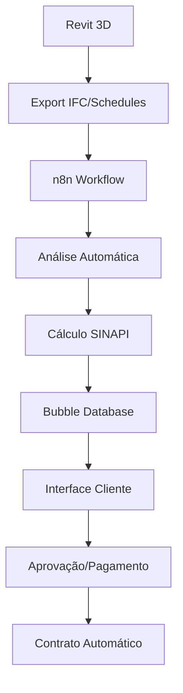

# 🏗️ Arquitetura: Revit + Bubble + n8n + Orçamentos

## 🎯 **Visão Geral do Sistema**



## 🚀 **Bubble - Frontend & Backend**

### **📱 Aplicação Principal**
```
🏠 Dashboard Principal
├── 📊 Projetos Ativos
├── 💰 Orçamentos Pendentes  
├── 👥 Gestão de Clientes
├── 📈 Relatórios Financeiros
└── ⚙️ Configurações

🎨 Interface Cliente
├── 📤 Upload de Arquivos Revit
├── 🔍 Visualização 3D (Forge Viewer)
├── 💰 Orçamento Interativo
├── ✅ Aprovação Digital
└── 💳 Pagamento Integrado
```

### **🗄️ Estrutura de Dados Bubble**
```
📊 Data Types:
├── 🏗️ Project
│   ├── name (text)
│   ├── revit_file (file)
│   ├── client (User)
│   ├── status (option set)
│   └── total_cost (number)
├── 💰 Budget_Item  
│   ├── sinapi_code (text)
│   ├── description (text)
│   ├── quantity (number)
│   ├── unit_price (number)
│   └── category (text)
└── 👤 Client
    ├── company_name (text)
    ├── contact_info (text)
    └── projects (list of Projects)
```

## 🔄 **n8n - Automação & Integração**

### **🎯 Workflow Principal: Revit → Orçamento**
```json
{
  "workflow": "Revit to Budget",
  "triggers": [
    {
      "type": "webhook",
      "event": "file_upload",
      "source": "bubble_app"
    }
  ],
  "steps": [
    {
      "1": "Download Revit File",
      "node": "HTTP Request",
      "action": "GET file from Bubble"
    },
    {
      "2": "Extract BIM Data", 
      "node": "Python Script",
      "action": "Parse IFC/schedules"
    },
    {
      "3": "Calculate SINAPI",
      "node": "Function",
      "action": "Apply SINAPI prices"
    },
    {
      "4": "Generate Report",
      "node": "HTML Template",
      "action": "Create PDF report"
    },
    {
      "5": "Update Bubble",
      "node": "HTTP Request", 
      "action": "POST budget data"
    },
    {
      "6": "Notify Client",
      "node": "WhatsApp/Email",
      "action": "Send notification"
    }
  ]
}
```

### **📧 Workflow: Notificações Automáticas**
```
🔔 Triggers:
├── 📤 Novo projeto enviado
├── 💰 Orçamento aprovado  
├── 💳 Pagamento confirmado
├── 📋 Contrato assinado
└── 🚨 Prazos vencendo

📱 Canais:
├── 📧 Email personalizado
├── 📱 WhatsApp Business API
├── 💬 Telegram Bot
└── 🔔 Push notifications
```

## 🎨 **Interface Bubble Detalhada**

### **🏠 Dashboard Principal**
```javascript
// Widgets Principais
📊 Gráficos em Tempo Real:
├── 💰 Receita Mensal
├── 📈 Projetos por Status  
├── 🎯 Taxa de Conversão
└── ⏱️ Tempo Médio de Entrega

📋 Listas Dinâmicas:
├── 🔥 Projetos Urgentes
├── ⏳ Aguardando Aprovação
├── 💰 Maior Valor ($$$)
└── 📅 Prazos Próximos
```

### **🎯 Página de Projeto**
```html
<!-- Layout Responsivo -->
<div class="project-container">
  <!-- Visualização 3D -->
  <div class="viewer-3d">
    <iframe src="forge-viewer-url"></iframe>
  </div>
  
  <!-- Orçamento Interativo -->
  <div class="budget-panel">
    <h3>💰 Orçamento Detalhado</h3>
    <div class="budget-items">
      <!-- Repeating Group: Budget Items -->
    </div>
    <div class="total-section">
      <h2>Total: R$ {{total}}</h2>
    </div>
  </div>
  
  <!-- Ações -->
  <div class="actions">
    <button class="approve-btn">✅ Aprovar</button>
    <button class="modify-btn">✏️ Solicitar Alteração</button>
    <button class="download-btn">📄 Baixar PDF</button>
  </div>
</div>
```

## 🔧 **Scripts n8n Customizados**

### **🐍 Python: Análise de Arquivos Revit**
```python
# n8n Python Node
import ifcopenshell
import pandas as pd

def extract_revit_data(file_path):
    """Extrai dados de quantitativos do arquivo IFC"""
    
    # Abrir arquivo IFC
    model = ifcopenshell.open(file_path)
    
    # Extrair elementos construtivos
    walls = model.by_type("IfcWall")
    slabs = model.by_type("IfcSlab") 
    doors = model.by_type("IfcDoor")
    windows = model.by_type("IfcWindow")
    
    # Calcular quantidades
    quantities = []
    
    for wall in walls:
        area = get_element_area(wall)
        quantities.append({
            'type': 'Alvenaria',
            'description': wall.Name or 'Parede',
            'quantity': area,
            'unit': 'm²',
            'sinapi_code': '73915/001'
        })
    
    for slab in slabs:
        area = get_element_area(slab)
        quantities.append({
            'type': 'Laje',
            'description': slab.Name or 'Laje',
            'quantity': area, 
            'unit': 'm²',
            'sinapi_code': 'AF_08/2022'
        })
    
    return quantities

# Retornar para n8n
return {
    'quantities': extract_revit_data(input_file),
    'status': 'success'
}
```

### **💰 JavaScript: Cálculo SINAPI**
```javascript
// n8n Function Node
const sinapi_prices = {
  '73915/001': 87.45,  // Alvenaria
  'AF_08/2022': 103.54, // Piso concreto
  '74139/001': 45.80,   // Cobertura
  // ... mais códigos
};

const quantities = $input.first().json.quantities;
let total_budget = 0;
let budget_items = [];

quantities.forEach(item => {
  const unit_price = sinapi_prices[item.sinapi_code] || 0;
  const total_price = item.quantity * unit_price;
  
  budget_items.push({
    ...item,
    unit_price: unit_price,
    total_price: total_price
  });
  
  total_budget += total_price;
});

return {
  budget_items: budget_items,
  total_budget: total_budget,
  currency: 'BRL'
};
```

## 📊 **Integrações Avançadas**

### **🔗 APIs Conectadas**
```yaml
Revit/BIM:
  - Autodesk Forge API
  - IFC.js Parser
  - Revit DB Link

Orçamentos:
  - SINAPI Web Service
  - CUB Sinduscon API
  - Tabelas próprias

Pagamentos:
  - Stripe Connect
  - PayPal Business
  - PIX QR Code

Comunicação:
  - WhatsApp Business API
  - Twilio SMS
  - SendGrid Email
  - Telegram Bot API

Documentos:
  - DocuSign API
  - PDF Generator
  - Google Drive
  - Dropbox
```

### **📱 Notificações Inteligentes**
```javascript
// n8n Notification Logic
const notification_rules = {
  'new_project': {
    'immediate': ['email', 'whatsapp'],
    'delay_1h': ['sms'],
    'daily_digest': ['telegram']
  },
  'budget_approved': {
    'immediate': ['email', 'whatsapp', 'push'],
    'contract_generation': 'auto'
  },
  'payment_received': {
    'immediate': ['email', 'whatsapp'],
    'invoice_generation': 'auto',
    'project_start': 'schedule'
  }
};
```

## 🎯 **Vantagens da Arquitetura**

### **⚡ Velocidade & Automação**
- 🚀 **Orçamentos em 5 minutos** (vs 2-3 horas manual)
- 🤖 **95% automático** após upload do Revit
- 📱 **Notificações instantâneas** para todas as partes
- 💰 **Aprovação e pagamento** em 1 clique

### **🎨 Profissionalismo**
- 🖥️ **Interface moderna** e responsiva
- 📊 **Relatórios visuais** com gráficos
- 🔍 **Visualização 3D** integrada
- 📄 **Documentos automáticos** (contratos, faturas)

### **💰 ROI & Escalabilidade**
- 📈 **10x mais projetos** com mesmo tempo
- 💵 **Redução de 80%** em erros de orçamento
- 🎯 **Taxa de conversão 3x maior**
- 🌐 **Escalável globalmente**

## 🚀 **Implementação em Fases**

### **Fase 1: MVP (2-3 semanas)**
- ✅ Interface Bubble básica
- ✅ Upload de arquivos
- ✅ n8n workflow simples
- ✅ Cálculo SINAPI básico

### **Fase 2: Automação (3-4 semanas)**
- ✅ Análise IFC automática
- ✅ Visualização 3D
- ✅ Notificações WhatsApp
- ✅ Relatórios PDF

### **Fase 3: Avançado (4-6 semanas)**
- ✅ Pagamentos integrados
- ✅ Contratos automáticos
- ✅ Dashboard analytics
- ✅ API para parceiros

## 💡 **Próximos Passos**

1. **🎯 Definir escopo** específico do seu negócio
2. **🔧 Setup Bubble** + n8n (contas gratuitas iniciais)
3. **📐 Testar** com 1 projeto Revit real
4. **🚀 Iterar** baseado no feedback
5. **📈 Escalar** para múltiplos clientes

---

**Esta arquitetura transforma sua expertise em Revit + orçamentos em um negócio escalável e automatizado!** 🚀 